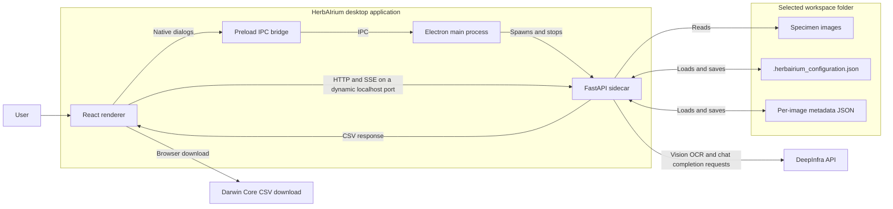

# HerbAIrium documentation

This documentation explains how HerbAIrium's desktop UI, Electron host, Python
sidecar, AI processing, workspace files, and release tooling fit together. It
is intended primarily for contributors and maintainers.

For installation and command-oriented setup, see the
[project README](../README.md).

## System overview

HerbAIrium is an Electron desktop application with a React renderer and a
locally spawned FastAPI sidecar. The renderer calls the sidecar over HTTP on
`127.0.0.1`; the sidecar reads specimen images from the selected workspace,
sends OCR and metadata-parsing requests to DeepInfra, and saves results beside
the source images.

## Guide

| Page | Contents |
|---|---|
| [Architecture](architecture.md) | Runtime boundaries, startup and shutdown, Electron IPC, React composition, and shared state |
| [Application workflows](workflows.md) | Workspace selection, image processing, batch execution, configuration, export, and cleanup |
| [API and data](api-and-data.md) | Sidecar endpoints, file-backed models, metadata lifecycle, and Darwin Core mapping |
| [Development and release](development-and-release.md) | Local topology, packaged resources, installer builds, and GitHub Actions releases |

## Source map

| Area | Primary implementation |
|---|---|
| Electron lifecycle and sidecar management | `electron/main/src/` |
| React UI, state, and sidecar client | `electron/renderer/src/` |
| HTTP API and batch event stream | `HerbAIrium/sidecar/server.py` |
| OCR and LLM orchestration | `HerbAIrium/utils.py` |
| DeepInfra requests | `HerbAIrium/clients/deepinfra_client.py` |
| Workspace configuration and metadata | `HerbAIrium/models/` |
| Desktop packaging | `electron/build/electron-builder.yml` |
| Automated installer builds and releases | `.github/workflows/build-windows.yml` |

The implementation is the source of truth. Update the relevant documentation
and diagrams when changing component boundaries, endpoint behavior, persisted
data, or release automation.
