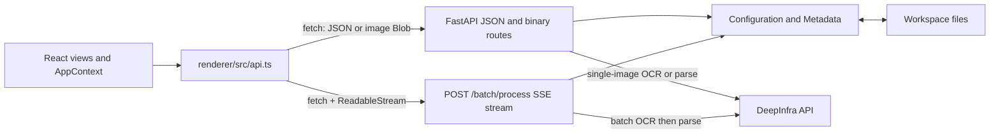
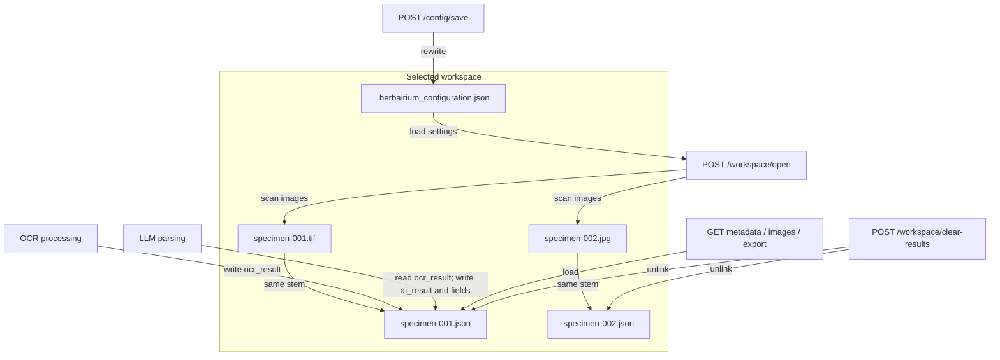

# Sidecar API and persisted data

This page documents the current FastAPI contract and workspace persistence
behavior for contributors and maintainers. For surrounding context, see the
[documentation index](README.md), [runtime architecture](architecture.md),
[application workflows](workflows.md), and
[development and release guide](development-and-release.md). The implementation
in `HerbAIrium/sidecar/server.py` and `HerbAIrium/models/` remains the source of
truth.

## Runtime API boundary

The Electron main process starts the Python sidecar on a dynamically selected
loopback port. The renderer initializes its API client with that port and calls
the sidecar directly. In development, `--dev` permits the Vite origin
`http://localhost:5173`; packaged operation does not enable that CORS
middleware.



The sidecar holds one process-global current `Configuration` (`_cfg`). Except
for `/health` and `/workspace/open`, routes require that a workspace has been
opened in the current sidecar process. Opening another folder replaces the
current workspace; there is no separate close operation or multi-workspace
session.

### Common errors

- A workspace-dependent route returns `409` with `No workspace open. Call POST
  /workspace/open first.` when `_cfg` is unset.
- An indexed image route returns `404` with `Image index out of range.` for a
  negative index or an index outside the current scan.
- FastAPI returns `422` for request bodies or path parameters that fail
  Pydantic validation.
- File decoding, persistence, image conversion, or AI failures are generally
  reported as `500` with a string `detail`. Errors are not represented by a
  stable machine-readable error schema.

## Endpoint inventory

All response examples below describe successful responses. JSON field names
are case-sensitive.

| Method and path | Purpose and successful response | Preconditions and notable errors |
|---|---|---|
| `GET /health` | Sidecar readiness probe. Returns `{"status":"ok"}`. | No workspace required. |
| `POST /workspace/open` | Opens and scans `folder_path`. Body: `{"folder_path":"..."}`. Returns `folder_path`, `image_count`, ordered `image_files`, per-image `images` summaries, and the loaded `config`. | `400` if the path does not exist or is not a directory; `422` for an invalid body. Configuration JSON parse/validation and directory-read failures are not translated explicitly and can surface as server errors. |
| `GET /config` | Returns `Configuration.model_dump()` for the current workspace. | Workspace required (`409`). The dump includes the runtime-assigned `configuration_path` extra field and can include other allowed extra fields loaded from disk. |
| `POST /config/save` | Applies non-`null` values for the ten declared connection, OCR, and parse settings, then rewrites `.herbairium_configuration.json`. Unknown request fields are ignored. Returns `{"saved":true}`. | Workspace required. `500` if `Configuration.save()` reports failure; `422` for invalid declared field types. Because `null` values are excluded, this endpoint cannot clear a setting to `null`. It does not rescan images. |
| `GET /images` | Returns ordered `image_files`, per-image `images` summaries, and `count`. | Workspace required. A corrupt individual metadata file is captured in that image's `status_error` rather than failing the whole response. |
| `GET /images/{index}/thumbnail` | Creates a maximum `256 × 256` thumbnail and returns `index`, `filename`, and a base64 `data_uri`. | Workspace and valid index required. Image open/decode/encode failures return `500`. |
| `GET /images/{index}/image` | Returns full image bytes. JPEG and PNG files are returned without transcoding; other scanned formats (currently TIFF) are decoded and converted to JPEG. | Workspace and valid index required. File-read or image-conversion failures return `500`. |
| `GET /images/{index}/metadata` | Loads or initializes the image's `Metadata` and returns its model dump, including raw and parsed fields plus the runtime-assigned `metadata_path` extra field. | Workspace and valid index required. Invalid/unreadable sidecar JSON can surface as a server error. Merely reading missing metadata does not create a file. |
| `POST /images/{index}/ocr` | Runs vision OCR in a worker thread, attempts to persist the raw result, then returns `ocr_result` and `image_path`. | Workspace and valid index required. AI/image failures are reported as `500`. A new run overwrites `ocr_result` but does not proactively clear an older `ai_result` or parsed fields. The utility currently ignores a `false` result from `Metadata.save()`, so a suppressed write failure may still produce a success response. |
| `POST /images/{index}/parse` | Parses the persisted OCR transcription, attempts to save the raw LLM response plus structured fields, and returns the complete metadata model. | Workspace and valid index required. Returns `400` when `ocr_result` is empty/missing. AI failures, malformed expected values, missing expected keys, and assignment validation errors generally return `500`. As with OCR, a write failure suppressed by `Metadata.save()` is not detected by the route. |
| `POST /batch/process` | Runs OCR for every scanned image, then parses only images whose OCR task succeeded. Returns an `text/event-stream`, not a JSON body. | Workspace required before streaming begins. Per-image failures are emitted as SSE `error` events; they do not change the HTTP status after the stream starts. |
| `GET /export/darwin-core` | Builds one CSV row per scanned image and returns UTF-8 `text/csv` with download name `darwin-core.csv`. | Workspace required. Any unreadable or invalid metadata file fails the whole export with `500`; images without metadata contribute blank fields. |
| `POST /workspace/clear-results` | Deletes every scanned image's same-stem `.json` sidecar. Returns `{"cleared":N}`. | Workspace required. Any unlink failure returns `500` after the loop; deletion is not transactional, so earlier files may already be gone. |

### Image summaries

`POST /workspace/open` and `GET /images` expose the same summary shape:

```json
{
  "index": 0,
  "path": "/workspace/specimen-001.tif",
  "filename": "specimen-001.tif",
  "ocr_complete": true,
  "parse_complete": false,
  "status_error": null
}
```

`ocr_complete` is `true` when loaded metadata has a truthy `ocr_result`;
`parse_complete` is based on a truthy raw `ai_result`, not on completeness or
validity of every parsed field. If metadata loading fails, both flags are
`false` and `status_error` contains the exception text.

### Batch SSE contract

The batch stream uses standard SSE records of the form
`data: <JSON>\n\n`. `EventSource` is not used because the route is `POST`; the
renderer consumes the `fetch()` response body.

During each stage, a file receives a `running` event followed by `ok` or
`error`:

```json
{
  "stage": "ocr",
  "current": 3,
  "total": 12,
  "filename": "specimen-003.tif",
  "status": "ok",
  "error": null
}
```

`stage` is `ocr` or `llm`. `current` counts completed files, so a `running`
event can repeat the current count. OCR and LLM stages are sequential; each
stage permits at most five concurrent tasks. The LLM stage's `total` is the
number of OCR successes, not necessarily the workspace image count. The final
event is:

```json
{
  "stage": "done",
  "ocr_ok": 11,
  "ocr_fail": 1,
  "llm_ok": 10,
  "llm_fail": 1
}
```

## Workspace discovery and index mapping

`Configuration` scans only direct children of the selected folder. A file is
included when it is a regular file and its lowercased name ends in `.jpg`,
`.jpeg`, `.png`, `.tif`, or `.tiff`. Nested directories are not traversed.
Results are sorted by lowercased basename, and the zero-based position in that
list is the API `{index}`.

The index is therefore a mapping into the in-memory scan, not a durable image
identifier. It stays fixed until another workspace is opened in that sidecar
process. Reopening after adding, deleting, or renaming images can assign
different indices. API consumers should refresh `image_files`/`images` after
opening a workspace and should not persist indices between scans.

For direct display:

- `/thumbnail` always decodes through Pillow, preserves aspect ratio, and fits
  within 256 pixels in each dimension. Images with transparency become PNG
  data URIs; other images become quality-85 JPEG data URIs.
- `/image` returns `.jpg`, `.jpeg`, and `.png` bytes in their original encoding.
  TIFF input is converted to RGB JPEG at quality 95 because browser support is
  not assumed.

## File-backed models

Both models subclass Pydantic `BaseSettings`, allow extra fields, and serialize
with `model_dump()` to ordinary JSON. They are file-backed objects rather than
a database or repository abstraction: construction loads a file if present,
and `save()` rewrites it directly. Each constructor also assigns its backing
file path as an allowed extra field (`configuration_path` or `metadata_path`).
That field appears in API model dumps and is persisted on the next save.
Because the models use `BaseSettings`, environment variables can supply fields
that were not provided by constructor arguments or loaded JSON; explicit
constructor and file values take precedence over that fallback.



### `Configuration`

The workspace configuration path is
`<workspace>/.herbairium_configuration.json`. Construction follows this order:

1. Scan and sort the current top-level image files.
2. Load the configuration JSON when it exists, with persisted values updating
   constructor arguments.
3. Replace any persisted `image_files` with the fresh scan.
4. Apply Pydantic validation/defaults and retain allowed extra keys.

The model contains:

| Group | Fields |
|---|---|
| Workspace inventory | `image_files` |
| Backing file path | `configuration_path` (runtime-assigned extra field) |
| Shared API access | `llm_base_url`, `deepinfra_api_key` |
| Vision OCR | `olm_model`, `olm_temperature`, `olm_max_tokens`, `olm_prompt` |
| Metadata parsing | `llm_parse_model`, `llm_parse_temperature`, `llm_parse_max_tokens`, `llm_parse_prompt` |

The API key is currently persisted in plaintext with the other settings.
Contributors must treat the configuration file as sensitive. Also note that
the current DeepInfra client uses the configured model, prompt, and
temperature; the `*_max_tokens` settings are persisted and exposed but are not
passed by the utility functions that initiate inference.

`save()` returns a boolean and suppresses its underlying exception. The API
turns `false` into a generic `500`.

### `Metadata`

For image `<workspace>/<stem>.<extension>`, metadata lives at
`<workspace>/<stem>.json`. Construction loads that JSON if it exists and then
forces `image_path` to the currently scanned image path. Missing metadata starts
as an in-memory model with `null` result fields; it is created only when a
processing save occurs.

Because persistence is based only on the stem, two supported images such as
`sheet.jpg` and `sheet.tif` map to the same `sheet.json`. Workspaces should keep
image stems unique. Clear-results uses the same mapping.

The raw processing fields are:

- `ocr_result`: verbatim text returned by the vision OCR call.
- `ai_result`: verbatim string returned by the metadata-parsing LLM, normally
  JSON text.
- `metadata_path`: runtime-assigned extra field containing the backing JSON
  path; it appears in model dumps and persisted metadata.

The structured fields are:

| Field | Type/meaning |
|---|---|
| `catalogNumber` | String derived from the image filename stem during parse. |
| `recordNumber` | Collector's record identifier; string or integer. |
| `family` | Taxonomic family. |
| `scientificName` | Genus and species name. |
| `scientificNameAuthorship` | Authorship following the scientific name. |
| `eventDate` | Collection date, prompted as `YYYY-MM-DD`. |
| `country` | Country name. |
| `stateProvince` | State or province. |
| `County` | County, with an uppercase `C` in persisted metadata and the LLM contract. |
| `Locality` | Free-text locality, with an uppercase `L` in persisted metadata and the LLM contract. |
| `decimalLatitude`, `decimalLongitude` | Optional coordinates; blank strings are normalized to `null`. |
| `recordedBy` | Primary collector. |
| `associatedCollectors` | Optional list of subsequent collectors. |
| `minimumElevationInMeters` | Optional elevation; a blank string is normalized to `null`. |

Assignment validation is enabled. Numeric coordinate/elevation fields accept
blank strings from LLM JSON by converting them to `null`; other invalid values
can raise validation errors.

## Metadata lifecycle

```mermaid
stateDiagram-v2
    [*] --> Unpersisted: Image scanned; no sidecar JSON
    Unpersisted --> OCRSaved: POST /ocr or successful batch OCR
    OCRSaved --> OCRSaved: OCR rerun overwrites ocr_result
    OCRSaved --> Parsed: POST /parse or successful batch parse
    Parsed --> Parsed: Parse rerun overwrites ai_result and structured fields
    Parsed --> OCRSaved: OCR rerun changes raw OCR but leaves old parse fields present
    OCRSaved --> Unpersisted: Clear results deletes sidecar JSON
    Parsed --> Unpersisted: Clear results deletes sidecar JSON
```



OCR loads any existing metadata, replaces `ocr_result`, and saves the complete
model. Parsing requires a truthy persisted `ocr_result`; it sets
`catalogNumber`, calls the LLM, stores the raw response in `ai_result`, parses
that response with `json.loads`, assigns every expected structured key, and
saves.

Current behavior has several maintenance implications:

- OCR reruns do **not** invalidate or clear an older `ai_result` and structured
  values. Until parse is rerun, summaries can show both stages complete even
  though the parsed fields came from older OCR text.
- If the LLM response is not valid JSON, the raw `ai_result` and
  `catalogNumber` are still saved, while structured fields retain their
  previously loaded values (or remain `null`).
- If valid JSON omits an expected key, field assignment raises before the final
  save; the parse endpoint/batch item reports an error.
- `Metadata.save()` returns `false` on write failure, but the current processing
  utilities do not check that return value. A request may therefore appear
  successful even when the rewritten metadata file was not persisted.

## Darwin Core CSV mapping

`GET /export/darwin-core` always writes the following fixed header and one row
per current `image_files` entry:

| CSV column | Metadata source/transformation |
|---|---|
| `catalogNumber` | `catalogNumber` |
| `recordNumber` | `recordNumber` |
| `family` | `family` |
| `scientificName` | `scientificName` |
| `scientificNameAuthorship` | `scientificNameAuthorship` |
| `eventDate` | `eventDate` |
| `country` | `country` |
| `stateProvince` | `stateProvince` |
| `county` | Persisted `County` |
| `locality` | Persisted `Locality` |
| `decimalLatitude` | `decimalLatitude` |
| `decimalLongitude` | `decimalLongitude` |
| `recordedBy` | `recordedBy` followed by `associatedCollectors`, excluding empty values and joined with `\|` |
| `minimumElevationInMeters` | `minimumElevationInMeters` |

The naming difference is intentional to document current behavior:
metadata/LLM fields are `County` and `Locality`, while Darwin Core CSV headers
are lowercase `county` and `locality`. `associatedCollectors` has no standalone
CSV column. Every `null` value is emitted as an empty cell. The exporter does
not require OCR or parse completion and does not validate Darwin Core
semantics, so an unprocessed image still produces a mostly blank row.

## Clear-results semantics

`POST /workspace/clear-results` computes `Path(image_path).with_suffix(".json")`
for every scanned image and calls `unlink(missing_ok=True)`. It removes the
entire metadata record: raw OCR, raw LLM output, parsed fields, and stored
`image_path`. It does **not** delete images, modify the configuration file,
rescan the workspace, or revoke/cancel an active AI request.

The returned `cleared` count is incremented after every successful unlink call,
including when a sidecar file was already absent, so it normally equals the
number of scanned images rather than the number of files that physically
existed. If any deletion fails, all files are attempted and the route then
returns `500` with the failure list; successfully deleted files are not
restored.
