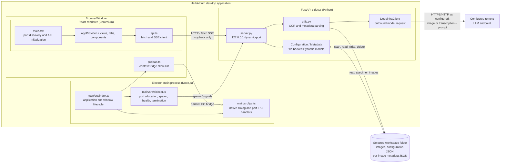
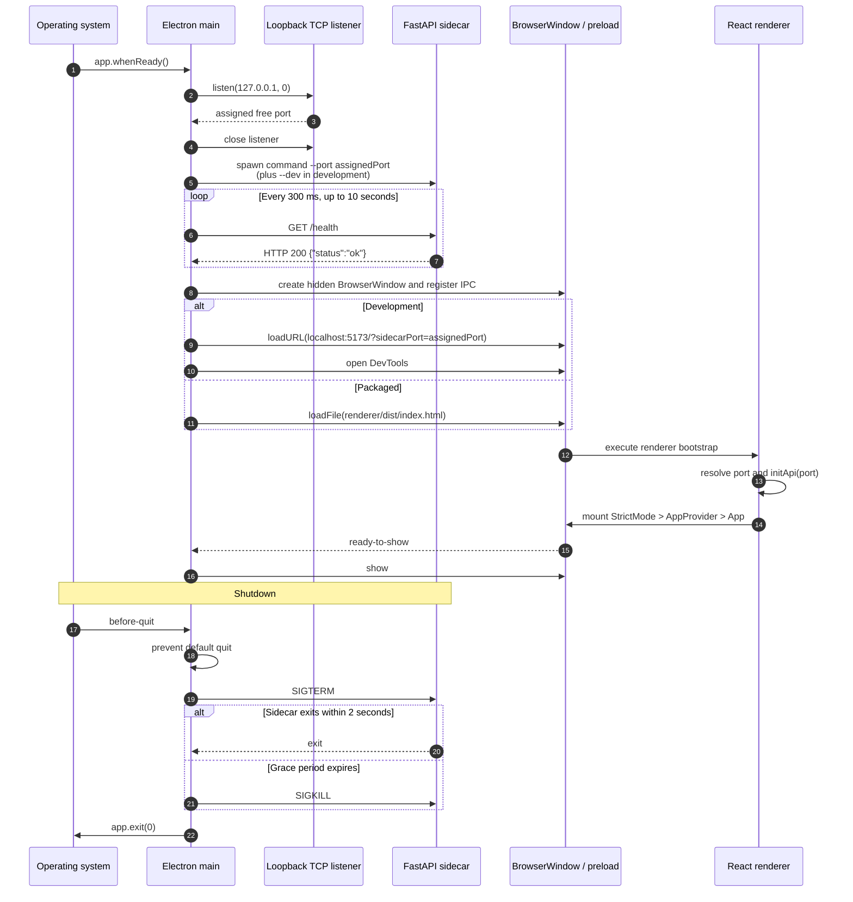
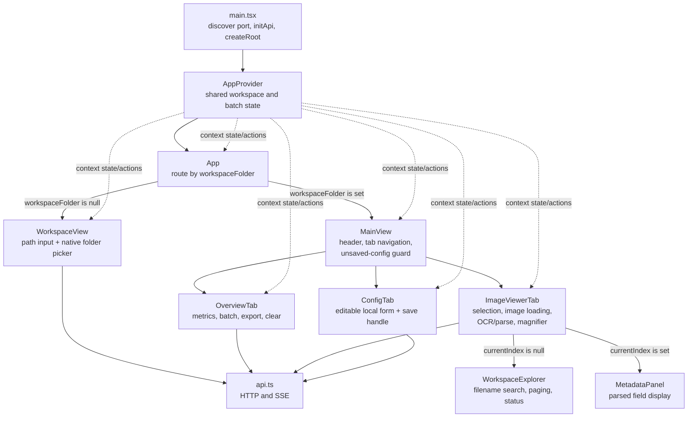
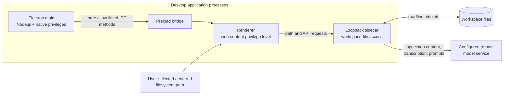

# HerbAIrium Runtime Architecture

This document describes the current desktop runtime for contributors and
maintainers. HerbAIrium is an Electron application whose React renderer talks
directly to a local FastAPI sidecar over HTTP. The Electron main process owns
the desktop window, native dialogs, sidecar lifecycle, and discovery of the
sidecar's dynamically allocated loopback port.

See also the [documentation index](README.md),
[application workflows](workflows.md), [API and data](api-and-data.md), and
[development and release](development-and-release.md).

## Runtime containers

### Container responsibilities

| Container | Current responsibility |
| --- | --- |
| Electron main process | Starts the sidecar before creating a window, creates the `BrowserWindow`, loads development or packaged renderer assets, exposes native dialogs through IPC, and stops the sidecar during application quit. |
| Preload bridge | Uses `contextBridge` to expose only `getSidecarPort`, `openFolderDialog`, and `confirmUnsavedConfiguration` as `window.electronAPI`. |
| React renderer | Initializes the sidecar base URL, owns UI and session state, calls the sidecar with `fetch`, and consumes batch progress as an SSE-formatted response stream. |
| FastAPI sidecar | Holds the currently open workspace configuration in process memory, serves images and metadata, performs OCR/LLM work, exports CSV, and reads or mutates workspace files. |
| Workspace folder | Stores source images, `.herbairium_configuration.json`, and one metadata `.json` file beside each image. It is not copied into application storage. |
| Remote model endpoint | Receives model requests assembled by `DeepinfraClient` using the configured endpoint, model, prompt, and temperature. |

## Electron main process and sidecar lifecycle

`main/src/index.ts` waits for Electron's `app.whenReady()`, then awaits
`startSidecar()`. A startup failure displays a native error box and quits
without creating a window.

`startSidecar()`:

1. Opens a temporary TCP listener on `127.0.0.1` with port `0`.
2. Reads the operating-system-assigned port, closes the listener, and stores
   the port in module state.
3. Spawns the development Python process or packaged executable with
   `--port <port>`.
4. Pipes sidecar standard output and error into the Electron process with a
   `[sidecar]` prefix.
5. Polls `GET /health` every 300 ms until it receives HTTP 200, with a 10-second
   timeout.

Only after the health check succeeds does the main process create the
`BrowserWindow`. The window starts hidden, has a minimum size, and is shown on
`ready-to-show`. It enables `contextIsolation`, disables renderer Node.js
integration, and loads the compiled preload script.

Closing all windows quits on platforms other than macOS. On macOS the process
and sidecar remain alive after the last window closes, and an application
activation attempts to call `createWindow()` when no window is present. A
closed window clears the main process's `mainWindow` reference.

The sidecar installs a `SIGTERM` handler that exits the Python process.
`killSidecar()` first sends `SIGTERM`, waits for the child `exit` event, and
falls back to `SIGKILL` after two seconds.

## Development and packaged startup

| Concern | Development | Packaged application |
| --- | --- | --- |
| Sidecar command | Repository `.venv/bin/python` | Bundled `herbairium-sidecar` executable (`.exe` on Windows) |
| Sidecar location | `HerbAIrium/sidecar/server.py` | `process.resourcesPath/sidecar/herbairium-sidecar[.exe]` |
| Sidecar arguments | `--port <dynamic-port> --dev` | `--port <dynamic-port>` |
| Renderer source | Vite at `http://localhost:5173` | `renderer/dist/index.html` in the application package |
| Port delivery | Main appends `?sidecarPort=<dynamic-port>` to the Vite URL | Renderer invokes preload's `getSidecarPort()` IPC method |
| CORS | Sidecar allows the exact Vite origin `http://localhost:5173` and private-network requests | Development CORS middleware is not installed |
| DevTools | Opened automatically | Not opened by startup code |

The renderer's `main.tsx` resolves the API port before mounting React:

1. Use a positive integer `sidecarPort` URL query parameter when present.
2. Otherwise, when the preload bridge exists, invoke `getSidecarPort`.
3. Otherwise, use port `8765` for standalone browser testing.

`initApi()` then fixes the renderer API base URL to
`http://127.0.0.1:<port>`. The fallback is a renderer-only testing behavior;
normal Electron startup always starts the sidecar on a dynamically allocated
port.

The packaged sidecar binaries are copied as `extraResources` by
electron-builder. Main and renderer JavaScript are packaged from their
respective `dist` directories.

## IPC and renderer-to-sidecar communication

The renderer does not use IPC for application data. It calls FastAPI directly
over loopback:

- JSON request/response endpoints open a workspace, load/save configuration,
  list images, fetch metadata, start per-image OCR or parsing, clear results,
  and request thumbnails.
- Image and Darwin Core export endpoints return binary responses.
- `POST /batch/process` returns `text/event-stream`. Because browser
  `EventSource` cannot issue that POST, `api.ts` uses `fetch`, reads the
  response body, splits SSE records on blank lines, and yields parsed progress
  events from an async generator.

IPC is intentionally limited to operations requiring the Electron main
process:

| IPC channel | Renderer-facing method | Main-process operation |
| --- | --- | --- |
| `get-sidecar-port` | `getSidecarPort()` | Reads the port stored by the sidecar manager. |
| `open-folder-dialog` | `openFolderDialog()` | Opens a native directory-only selection dialog and returns one path or `null`. |
| `confirm-unsaved-configuration` | `confirmUnsavedConfiguration()` | Opens a window-owned Save/Discard/Cancel warning dialog. |

## React bootstrap, components, and state

`renderer/index.html` supplies the `#root` element. `main.tsx` initializes the
API first, then renders `React.StrictMode`, `AppProvider`, and `App`.

### `AppProvider` state

The provider owns state shared across routes and tabs:

| State | Purpose |
| --- | --- |
| `workspaceFolder` | Selects `WorkspaceView` versus `MainView` and identifies the current workspace in the header. |
| `config` | In-memory configuration returned by the sidecar; used by processing controls to require a non-empty API-key field. |
| `imageFiles` | Ordered paths returned by the sidecar's workspace scan. |
| `imageSummaries` | Per-image completion/error status used by overview metrics and the explorer. |
| `currentIndex` | `null` displays the explorer; an index displays one image and its metadata. |
| Batch state | `batchRunning`, normalized `batchProgress`, status text, and final success/failure counts. |

The provider also owns the batch `AbortController` and a monotonically
increasing run ID. Cancel/reset aborts the renderer's fetch and invalidates
events from older runs. Progress events update `imageSummaries` as OCR and LLM
stages finish. The sidecar performs each stage with at most five concurrent
workers; the LLM stage only receives files whose OCR stage succeeded.

Changing workspace in `App` cancels an active batch after browser confirmation,
resets batch state, and clears all workspace-related provider state.

### View and tab ownership

- **`WorkspaceView`** keeps path-entry, loading, and error state locally.
  Opening a folder calls `POST /workspace/open`; a successful non-empty result
  populates provider state. Browse uses the preload bridge's native dialog.
- **`MainView`** defaults to the Image viewer tab. It owns active-tab state and
  coordinates unsaved configuration navigation. When leaving a dirty
  Configuration tab, it asks the main process for Save/Discard/Cancel; Save
  invokes `ConfigTab.save()` through an imperative ref.
- **`OverviewTab`** derives photo/OCR/parse counts from provider state. It
  starts batch processing, downloads the Darwin Core response through an
  object URL, and can delete all per-image metadata files after confirmation.
- **`ImageViewerTab`** uses `WorkspaceExplorer` until an image is selected. For
  a selection it loads the thumbnail, full image, and metadata; aborts stale
  loads; revokes object URLs; supports indexed navigation and magnification;
  and starts OCR or parsing for that image. `MetadataPanel` renders the parsed
  fields.
- **`WorkspaceExplorer`** owns filename filtering and pages results in groups
  of 100 while preserving the sidecar-provided image index for selection.
- **`ConfigTab`** copies provider configuration into local form state, computes
  dirty state against the provider value, serializes saves to avoid duplicate
  requests, excludes `image_files` from the save request, and updates provider
  configuration only after a successful sidecar save.

## Sidecar runtime and persistence

The sidecar binds Uvicorn to `127.0.0.1` and stores one current
`Configuration` instance in the process-global `_cfg`. Endpoints other than
health and workspace open require that state and return HTTP 409 when no
workspace is open.

Opening a workspace validates the path, scans only its immediate files for
supported image extensions, sorts them case-insensitively by filename, and
loads existing workspace configuration. The fresh scan always replaces any
saved `image_files` list.

Configuration saves write `.herbairium_configuration.json` in the workspace.
Metadata loads and saves use a `.json` path with the same stem as each image.
OCR and LLM parsing run blocking model work in worker threads so the FastAPI
event loop can continue serving requests. Clearing results deletes those
per-image JSON files. No database or separate application data directory is
used by this runtime.

## Trust boundaries and security-relevant behavior

- **Renderer/main boundary:** `contextIsolation` is enabled and
  `nodeIntegration` is disabled. The preload does not expose `ipcRenderer`
  itself; it exposes three fixed Promise-returning methods.
- **Renderer/sidecar boundary:** the renderer can reach all sidecar HTTP
  endpoints and supplies workspace paths and configuration values. The API has
  no authentication or origin validation of its own; its primary exposure
  control is binding only to loopback. Development mode additionally enables
  CORS for the exact Vite origin.
- **Sidecar/filesystem boundary:** after path validation, the sidecar is the
  authority that scans and accesses the selected directory. It reads specimen
  images, writes configuration and metadata JSON, and can delete metadata JSON
  through the clear-results endpoint. Treat opening a workspace and clearing
  results as privileged file operations.
- **Local persistence boundary:** configuration is serialized into the
  workspace, including the API-key configuration field. Contributors should
  treat that file as sensitive and avoid logging, committing, or sharing it.
  The password input only masks display in the renderer; it does not encrypt
  persisted configuration.
- **Remote-service boundary:** OCR requests can include the full encoded
  specimen image; parse requests include the OCR transcription. Both include
  the configured prompt, model, and temperature and are sent to the configured
  base URL. Workspace content therefore crosses the local-machine boundary
  when processing is invoked. The current client fixes request `max_tokens` at
  4096 even though max-token fields are present in configuration.
- **Native dialogs versus browser dialogs:** folder selection and unsaved
  configuration confirmation cross the preload IPC bridge. Batch/workspace
  cancellation and destructive-result confirmation currently use renderer
  `window.confirm`; notifications use renderer alerts/toasts.

## Operational failure behavior

- If `startSidecar()` rejects, including when `/health` does not return 200
  within ten seconds, startup is aborted and the main process shows a native
  startup error.
- Failure to load packaged renderer assets shows a native error and quits.
- Sidecar HTTP failures are converted by `api.ts` into renderer `Error`
  instances using the response's `detail` field when available.
- Per-image load requests and renderer batch streams are abortable. Batch
  cancellation stops consuming the HTTP response, while sidecar task cleanup
  is governed by the async streaming generator and connection lifetime.
- Sidecar exit is logged by the main process; there is no automatic sidecar
  restart or renderer reconnection path.
