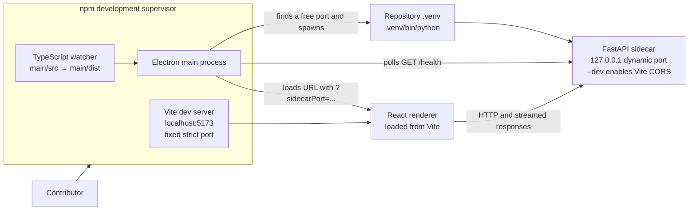
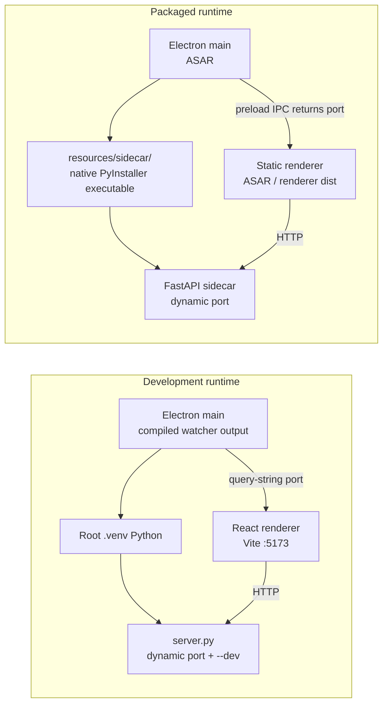
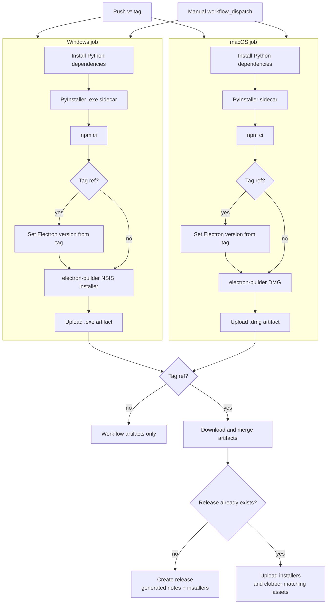

# Development and release

This guide describes the contributor-facing development, packaging, and
release paths for HerbAIrium. For installation and command-oriented setup, use
the [root README](../README.md#development); this page focuses on how those
commands map to the application architecture and release automation.

See also:

- [Documentation overview](README.md)
- [Architecture](architecture.md)
- [Application workflows](workflows.md)
- [API and data](api-and-data.md)

## Local development topology

Running the development command from `electron/` starts three cooperating
processes:

1. Vite serves the React renderer on the fixed, strict port `5173`.
2. TypeScript watches and compiles the Electron main process into
   `electron/main/dist/`.
3. Electron starts after Vite is reachable. Its main process chooses an
   available loopback port, launches the Python sidecar, waits for
   `GET /health`, and then opens the renderer.

The Electron process does **not** expect contributors to start the sidecar
separately. In development it invokes the repository virtual environment
directly at `.venv/bin/python` and runs
`HerbAIrium/sidecar/server.py` with the selected `--port` and `--dev`.
Consequently, the virtual environment must exist at the repository root and
contain the sidecar requirements. The current development launcher uses the
POSIX virtualenv path; a Windows-native development launcher would need to use
`.venv\Scripts\python.exe` instead. This does not affect the packaged Windows
application, which runs the bundled executable rather than a virtualenv.

The dynamic port avoids assuming that `8765` is free. Electron briefly binds
to port `0` on `127.0.0.1`, records the operating-system-assigned port, closes
that probe socket, and passes the port to the sidecar. It health-polls every
300 ms for up to 10 seconds before creating the application window. The
renderer receives the port in the Vite URL query string and configures its API
base URL as `http://127.0.0.1:<port>`.

The sidecar's `--dev` option permits CORS requests from
`http://localhost:5173`. Port `8765` is only the sidecar server's command-line
default and the renderer's fallback for standalone browser testing; normal
Electron development uses the dynamically selected port.

Use the setup and run commands in [README: Development](../README.md#development)
rather than maintaining a second command list here.

## Development shutdown and troubleshooting

Electron owns the sidecar lifecycle. Before quitting, it sends `SIGTERM`,
waits up to two seconds, and then uses `SIGKILL` if the child has not exited.
Sidecar standard output and error are forwarded to the Electron process with a
`[sidecar]` prefix.

Common checks:

- If Electron cannot spawn the sidecar, confirm that the root `.venv` exists
  at the exact path expected by `electron/main/src/sidecar.ts` and that its
  dependencies are installed.
- If Vite fails to start, port `5173` is already occupied; Vite uses
  `strictPort: true` and will not silently select another port.
- If startup reports an unhealthy background process, run the sidecar through
  the root README's development setup and inspect its Python error output.
- When changing API calls or persisted data, consult [API and data](api-and-data.md);
  for application behavior, consult [Application workflows](workflows.md).

## Packaged runtime

Packaged applications do not ship Python, use the contributor virtualenv, or
start Vite. PyInstaller produces a platform-native, single-file
`herbairium-sidecar` executable from
`HerbAIrium/sidecar/sidecar.spec`. The spec includes the project modules,
Uvicorn internals, and Pillow image plugins needed at runtime.

electron-builder packages the compiled Electron main process and static
renderer output into the application ASAR. Its platform-specific
`extraResources` entry copies the separately built sidecar outside the ASAR:

| Platform | PyInstaller input to electron-builder | Installed resource |
|---|---|---|
| macOS | `HerbAIrium/sidecar/dist/herbairium-sidecar` | `sidecar/herbairium-sidecar` |
| Windows | `HerbAIrium/sidecar/dist/herbairium-sidecar.exe` | `sidecar/herbairium-sidecar.exe` |

At runtime, Electron resolves that file below `process.resourcesPath`, chooses
a free loopback port exactly as it does in development, launches the binary
with `--port`, and waits for the health endpoint. No `--dev` flag is supplied.
The renderer is loaded from `renderer/dist/index.html`; it obtains the dynamic
port through the context-isolated preload/IPC bridge and then talks directly
to the sidecar over HTTP.

Because PyInstaller output is platform-specific, build the sidecar on the same
operating system targeted by electron-builder. Packaging fails if the expected
file is absent from `HerbAIrium/sidecar/dist/`.

## Local packaging

Follow [README: Building a release](../README.md#building-a-release) for the
maintained commands.

The packaging stages are:

1. Build the target platform's PyInstaller sidecar.
2. Compile the Electron main process and production renderer.
3. Run electron-builder for the target platform.
4. Confirm the installer in the repository-root `dist/` directory.

The macOS configuration creates a DMG, enables hardened runtime, applies the
configured entitlements, disables automatic certificate discovery in CI, and
does not currently notarize the application. The Windows configuration creates
an NSIS installer that lets the user choose the installation directory and
adds Start menu and desktop shortcuts. It requests normal user execution
(`asInvoker`).

Neither packaging path is cross-platform in the maintained release workflow:
the macOS sidecar and DMG are built on `macos-latest`, while the Windows
sidecar and NSIS installer are built on `windows-latest`. With no explicit
electron-builder architecture flag, outputs follow the architecture of the
selected build runner or local host.

## Automated build and release workflow

`.github/workflows/build-windows.yml` is named **Build desktop release** even
though it builds both Windows and macOS. It has two triggers:

- A push of any tag matching `v*`.
- A manual `workflow_dispatch` run from GitHub Actions.

Both triggers run the macOS and Windows jobs in parallel. Each job checks out
the repository, installs Python 3.10 and the sidecar dependencies plus
PyInstaller, builds the native sidecar, installs the Electron and renderer npm
dependencies with `npm ci`, and invokes the platform package script. Code
signing identity auto-discovery is disabled. The resulting `.exe` and `.dmg`
are always uploaded as GitHub Actions artifacts.

For a tag build, each platform job removes the leading `v` from the tag and
uses `npm version --no-git-tag-version` in the checked-out `electron`
workspace. This makes the installer/application version match the tag without
creating another Git tag or committing the temporary version change. A manual
run does not perform this step, so it packages the version already recorded in
`electron/package.json`.

The release publication job runs **only** for tag refs and waits for both
platform builds. It downloads and merges the two installer artifacts, then
uses the GitHub CLI and the workflow's `contents: write` permission to publish
them:

- If the tagged GitHub Release does not exist, it creates one with a title
  derived from the tag and generated release notes.
- If the release already exists, it uploads the installers with `--clobber`,
  replacing same-named assets.

Manual runs therefore produce downloadable workflow artifacts but do not
create or update a GitHub Release.

Before pushing a release tag, maintainers should verify that the intended
version is valid without the leading `v`, that both sidecar and Electron
changes are committed, and that local development still starts successfully.
After the workflow completes, verify both installers are attached to the
tagged release and perform a smoke test on each target operating system.
