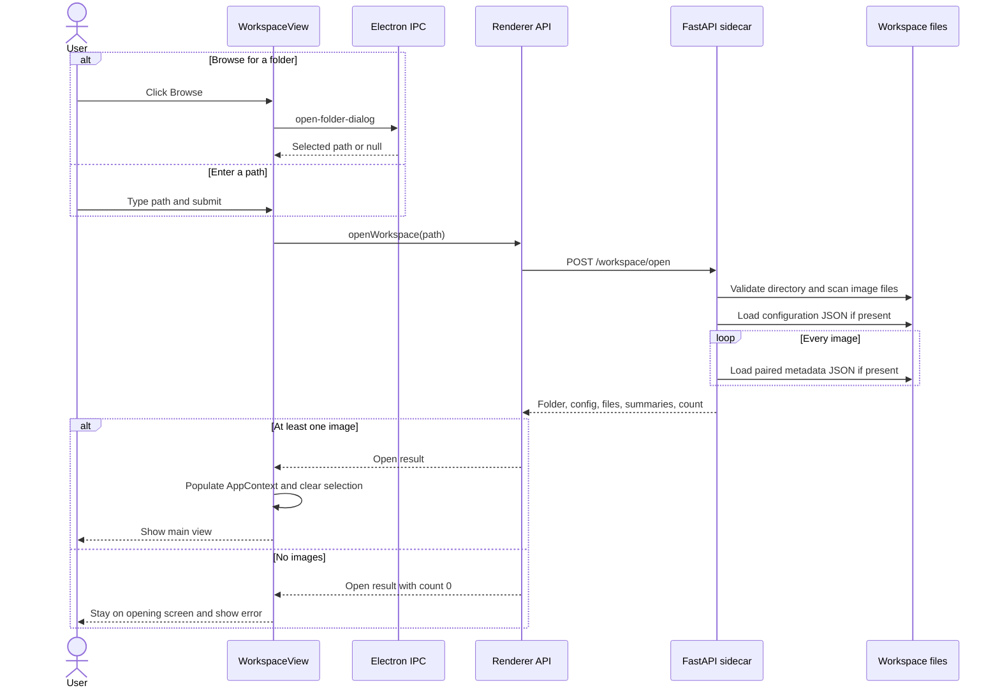
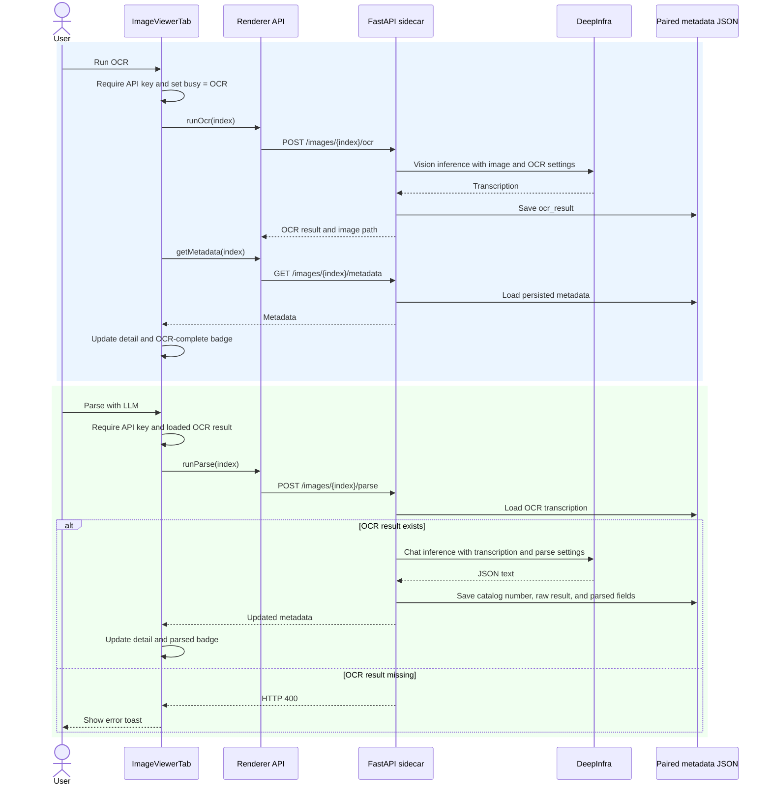
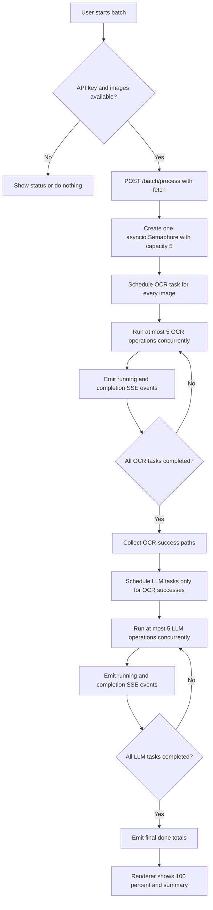
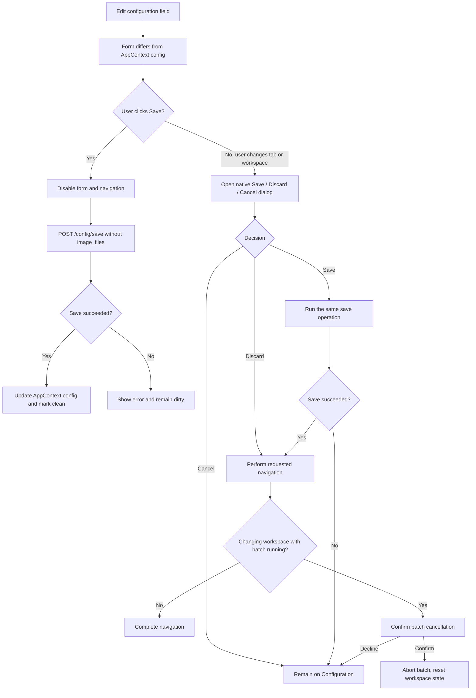

# Application workflows

This page describes the user-visible workflows and the implementation paths
that maintain them. It is intended for contributors changing the React
renderer, Electron IPC bridge, FastAPI sidecar, or file-backed models.

See also the [documentation index](README.md), [architecture](architecture.md),
[API and data reference](api-and-data.md), and
[development and release guide](development-and-release.md).

## Workflow boundaries

- The React renderer owns navigation, transient UI state, and progress display.
- Electron IPC is used only for native folder and confirmation dialogs in these
  workflows.
- The renderer sends HTTP requests to the FastAPI sidecar on its assigned
  `127.0.0.1` port.
- The sidecar holds the currently open `Configuration` in memory and reads or
  writes workspace files.
- Each image's results are stored in a same-stem JSON file beside the image.

## Opening and changing workspaces

The opening screen accepts a typed path or obtains one from Electron's native
directory chooser. `POST /workspace/open` validates the path, constructs a
`Configuration`, scans the folder's top level for `.jpg`, `.jpeg`, `.png`,
`.tif`, and `.tiff` files, sorts them case-insensitively by basename, and loads
`.herbairium_configuration.json` when it exists.

The response contains the configuration, image paths, and image summaries.
Each summary is derived from the paired metadata JSON and reports not started,
OCR complete, parsed, or a metadata-loading error. The renderer enters the
main view only when at least one image was found; otherwise it leaves the
workspace selection screen visible with an error.

Changing workspace clears the renderer's current folder, configuration, image
lists, selected image, and batch state, returning to the opening screen. Two
guards can run before that reset:

1. Leaving a dirty Configuration tab invokes the native Save/Discard/Cancel
   dialog described below.
2. If a batch is running, a browser confirmation asks whether to cancel the
   remaining work. Confirming aborts the batch request; declining keeps the
   current workspace.

## Browsing images

The Image viewer tab initially shows the workspace explorer:

- Images can be filtered by a case-insensitive filename substring.
- Results are paginated in groups of 100.
- Badges reflect each `ImageSummary`: Not started, OCR complete, Parsed, or
  Metadata error.
- Selecting a row stores its stable workspace index in `AppContext`.

For a selected image, the renderer requests the thumbnail and metadata
together and independently requests the display image. JPEG and PNG files are
served directly; other supported formats are converted to JPEG by the
sidecar. Request IDs and `AbortController` prevent a previous selection's
responses from replacing the current image. Blob object URLs are revoked
during cleanup.

The detail view provides first/previous/next/last navigation, a return to the
explorer, the parsed metadata panel, expandable raw OCR and LLM results, and a
hover magnifier. While hovering, `+` and `-` adjust magnification between
1.5x and 5x.

## Single-image OCR and LLM parsing

Both actions require a configured DeepInfra API key and disable each other
while one is running.

**OCR** calls `POST /images/{index}/ocr`. The sidecar runs the synchronous
vision request in a worker thread, stores `ocr_result` in the paired JSON, and
returns. The renderer then reloads metadata so the detail panel and summary
badge reflect the persisted result.

**LLM parsing** is enabled only when the loaded metadata has an OCR result.
The endpoint enforces the same prerequisite. It sends the transcription to
the configured parse model, sets `catalogNumber` from the image stem, stores
the raw response in `ai_result`, maps valid JSON fields into `Metadata`, and
saves the paired JSON. The returned metadata updates the panel and summary.

Processing remains associated with the index captured when the action starts.
If the user selects another image before completion, the summary still
updates, but the old result does not replace the newly selected detail view.

## Two-stage batch processing

The Overview action **Parse all images (OCR + LLM)** requires an API key and
starts `POST /batch/process`. The endpoint is POST, so the renderer cannot use
the GET-only `EventSource` API. Instead, `batchProcessStream` uses `fetch`,
reads `Response.body` with a stream reader, splits SSE frames on blank lines,
and parses each `data: ` JSON payload.

The sidecar runs two strictly ordered stages:

1. OCR is scheduled for every workspace image.
2. After all OCR tasks finish, LLM parsing is scheduled only for images whose
   OCR task succeeded.

A single `asyncio.Semaphore(5)` is shared by both stages, limiting active
worker-thread operations to five. Each task emits `running`, then `ok` or
`error`. A final `done` event contains success and failure totals. A failed
image does not stop other tasks.

The renderer treats OCR as the first half of the progress bar and LLM parsing
as the second half. Successful completion events update image badges and clear
a stale `status_error`; failed events store the current error on that image.
An `AbortController` supports cancellation when changing workspace; a run ID
prevents events from an obsolete stream from updating newer state.

## Configuration saving and navigation

The Configuration tab edits a local form copied from the configuration in
`AppContext`. Dirty state compares only editable connection, OCR, and parse
settings. Saving removes `image_files` from the payload and sends
`POST /config/save`; the sidecar updates its in-memory `Configuration` and
writes `.herbairium_configuration.json`. On success, the renderer replaces
the context configuration, making the form clean.

Only navigation initiated by the main tab bar or **Change workspace** passes
through this unsaved-navigation guard. While saving or awaiting a decision,
the navigation controls are disabled and duplicate save/navigation attempts
reuse or defer to the active operation.

## Darwin Core export

**Export Darwin Core CSV** sends `GET /export/darwin-core`. The sidecar creates
one row per workspace image, loading each paired metadata file or using empty
defaults when none exists. The fixed columns are:

`catalogNumber`, `recordNumber`, `family`, `scientificName`,
`scientificNameAuthorship`, `eventDate`, `country`, `stateProvince`, `county`,
`locality`, `decimalLatitude`, `decimalLongitude`, `recordedBy`, and
`minimumElevationInMeters`.

`recordedBy` combines the primary collector and associated collectors with
`|`. Missing values become empty CSV cells. The renderer downloads the blob as
`darwin-core.csv`. Export is disabled during batch processing, clearing, or
another export. See [API and data](api-and-data.md) for field mapping details.

## Clearing results

**Clear all OCR and parse data** first presents an irreversible-action browser
confirmation. On confirmation, `POST /workspace/clear-results` attempts to
delete the same-stem metadata JSON for every image; missing files are accepted.
If any deletion fails, the endpoint returns an error listing the failures.

After a successful response, the renderer:

1. marks every summary as neither OCR-complete nor parse-complete;
2. clears summary errors;
3. returns the Image viewer to its explorer;
4. aborts and resets any retained batch state; and
5. reports the number of image metadata paths cleared.

The clear action is disabled while a batch, export, or another clear operation
is active. It does not delete images or
`.herbairium_configuration.json`.
